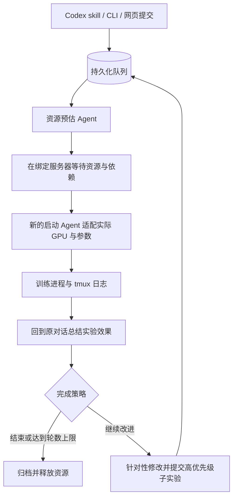
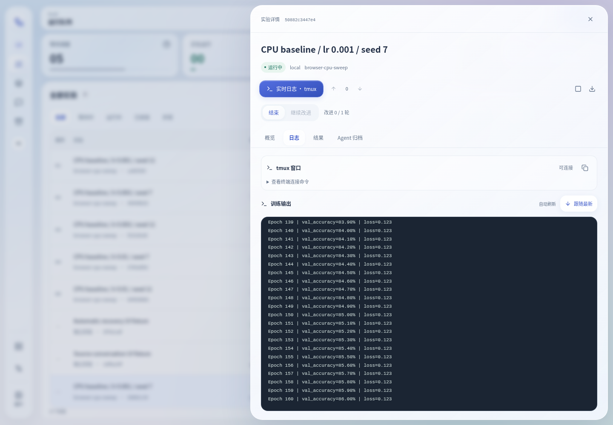

# DeepQueue

**一次提交多组实验，让队列按服务器资源逐个运行，再把结果交回原来的 Codex 对话。**

DeepQueue 是面向机器学习实验的 GPU 命令队列系统。它通过 Codex app-server 预估资源、适配启动参数和总结实验效果，提供网页、CLI 和 Codex skill，支持公网主控通过 SSH 管理多台训练服务器。

[Docker 部署](docs/docker-deployment.md) · [使用与 CLI](docs/operations.md) · [Codex 工作区](docs/codex-workspace.md) · [系统设计](docs/design.md)

## 核心能力

- **按服务器独立排队**：每台服务器拥有自己的运行队列、实验批次、Codex 工作区和 Agent 归档。任务始终在提交时绑定的服务器执行。
- **批量实验与依赖**：支持 JSON 批次、参数矩阵、实验依赖、幂等提交、优先级和等待老化；可独立暂停实验、批次或服务器的新任务。
- **资源评估与自动启动**：预估 GPU 数量、显存、CPU 和内存；获得资源后，由新的启动 Agent 适配实际 GPU 映射、分布式参数及必要的启动配置。
- **自动修复启动失败**：识别 GPU 映射、部分分布式启动错误和 CUDA OOM，在重试限额内调整参数，保留每次尝试的命令、日志和结果。
- **回到原对话总结**：提交时绑定真实 Codex 对话 ID。完成后在该对话中分析精度、损失、与基线的差异和下一步建议，并保存归档及深度链接。
- **可控的持续改进**：支持“结束”或“继续改进”；默认最多额外改进 1 轮，可以指定轮数，并在运行中通过网页或 CLI 修改后续计划。
- **实时训练日志**：每次执行保留 tmux 窗口；网页点击日志入口自动跳到最新输出，向上翻阅时暂停跟随，可一键回到最新。
- **网页 Codex 工作区**：读取各服务器的项目与对话，支持 npm/nvm 安装查找、会话缓存、实时聊天、`/` 插件与 skill 选择、权限设置、分支新聊天，以及可收起的交互终端、项目文件和网页服务预览；对话中的文件链接与变更记录可直接打开右侧预览。
- **统一管理**：全局设置各阶段的模型和推理强度；服务器支持 SSH 密码或密钥、显示名称编辑、排序和资源详情折叠。

## 实验如何运行



| 阶段       | 工作重点                                                                     |
| ---------- | ---------------------------------------------------------------------------- |
| 资源预估   | 估计所需资源，记录代码或配置中可能影响运行的问题，交给启动 Agent 处理        |
| 启动适配   | 根据实际分配卡号检查可见设备和分布式配置，以必要的参数调整启动实验           |
| 归档与改进 | 根据日志总结主要精度与损失变化，与上一次或指定基线比较，提出有证据支持的改进 |

例如，实验需要 4 张卡，实际分配的是物理卡 `0、1、3、7`：系统按 GPU UUID 绑定设备，启动 Agent 使训练程序使用对应的逻辑设备和进程数量。OOM 修复可以调整 batch size 等内存相关参数；每次改动均保存在执行记录中。

“继续改进”的轮数不包含初次运行。改进子实验以高优先级入队，仍需满足资源与依赖条件，不抢占已经运行的训练。来源对话正在工作时，反馈会等待它空闲。



_界面示例使用测试数据，不代表实际模型训练效果。_

## Docker 公网部署

部署机需要 **Docker Engine 和 Compose v2**。主控运行网页/API、SQLite 队列和一个调度器，通过 SSH 连接训练服务器，主控本身无需 GPU。

### 1. 获取项目并配置域名

```bash
git clone https://github.com/Threeausj/deepqueue.git
cd deepqueue
cp .env.example .env
```

编辑 `.env`：

```dotenv
DEEPQUEUE_PUBLIC_URL=https://queue.example.com
DEEPQUEUE_PORT=8765
DEEPQUEUE_START_SCHEDULER=false
# 可选：填写 12–128 位管理员密码，留空使用令牌登录
DEEPQUEUE_ADMIN_PASSWORD=
```

将地址换成实际 HTTPS 域名，DNS 指向部署机。使用内置 Caddy 时，公网需要能访问 80、443 端口；已有服务占用宿主机 8765 时，修改 `DEEPQUEUE_PORT`。

### 2. 构建并初始化

```bash
docker compose build
docker compose run --rm deepqueue setup
```

保存首次输出的 **`admin.token`**，用于网页登录和忘记密码时恢复访问。如果填写了 `DEEPQUEUE_ADMIN_PASSWORD`，初始化也会启用密码登录；密码包含 `$`、`#` 等字符时，在 `.env` 中用单引号包裹。初始化会暂停容器的 `local` 执行服务器；训练服务器统一通过 SSH 添加。前端在镜像构建时自动编译。

### 3. 配置主控 Codex

```bash
docker compose run --rm deepqueue codex login --device-auth
docker compose run --rm deepqueue codex login status
```

使用自定义模型提供商时，在持久化的 `/home/deepqueue/.codex` 目录中配置 `config.toml` 和相应凭据。各阶段的模型及推理强度随后在网页“通用设置”中选择。项目默认开发模型为 `gpt-5.6-luna`，实际可用模型取决于你的 Codex 配置。

### 4. 启动网页与 HTTPS

```bash
docker compose --profile https up -d
docker compose ps
docker compose logs --tail=100 deepqueue caddy
```

打开配置的 HTTPS 域名，用管理员令牌或已设置的密码登录。默认勾选“在此浏览器记住登录 30 天”，刷新页面或重开浏览器可自动恢复登录；取消勾选则使用浏览器会话 Cookie，服务端最多有效 12 小时。主动退出会清除该浏览器的登录 Cookie。

可在 **通用设置 → 密码登录** 随时启用、修改或关闭密码，立即生效。修改密码会撤销其他密码登录，当前修改密码的浏览器保持登录；关闭后，使用密码登录的浏览器需要改用管理员令牌。CLI/skill 的服务器提交令牌不受影响。服务端保存加盐密码摘要，本站登录 Cookie 使用 HttpOnly，HTTPS 下同时启用 Secure；浏览器不保存明文密码。

忘记密码时，可以用管理员令牌登录后重设，或在部署机交互式执行：

```bash
docker compose exec deepqueue deepqueue access password set
# 查看状态或关闭密码登录（保留管理员令牌认证）
docker compose exec deepqueue deepqueue access password status
docker compose exec deepqueue deepqueue access password disable
```

`.env` 中的密码只在 `setup` 尚未配置过密码时应用；后续重启、重复初始化不会覆盖网页/CLI 修改，也不会重新打开已关闭的密码登录。初始化后可清空 `.env` 中的密码。

如果主机已有 HTTPS 反向代理，只启动应用：

```bash
docker compose up -d deepqueue
```

已有代理的上游使用 `http://127.0.0.1:8765`，或修改后的宿主机端口，并关闭代理缓冲以支持实时输出。配置示例见 [Nginx 模板](deploy/nginx.conf.example)。

### 5. 接入训练服务器并启用调度

1. 在“服务器资源”中填写 SSH 地址、用户名和密码或密钥，核对主机指纹并探测资源。
2. 远端准备 Bash、Python 3.10+、tmux 和训练环境；GPU 服务器需要 NVIDIA 驱动及 `nvidia-smi`。实验目录填写远端绝对路径。
3. 在该服务器的“Codex 工作区 → 连接设置”中连接远端 Codex。远端使用拥有原对话记录的账户和 Codex 数据目录。
4. 在“通用设置”中配置模型与推理强度；从服务器“接入配置”生成提交令牌并下载专属 skill。
5. 资源与 Codex 连接正常后，在“通用设置 → 系统运行”启动调度。

镜像固定的 Codex 版本、远端共享服务的安装要求、SSH 密钥挂载、备份和旧队列迁移，见 [完整 Docker 部署指南](docs/docker-deployment.md)。

默认每次容器启动后调度器保持停止。需要随容器启动时，将 `DEEPQUEUE_START_SCHEDULER` 设为 `true` 并重新创建服务。

## 通过 Agent 和 skill 提交实验

在训练服务器的 Codex 环境中安装 DeepQueue CLI，然后配置该服务器对应的提交客户端：

```bash
deepqueue --url https://queue.example.com --target-server gpu-a client configure
deepqueue skill install --path ~/.agents/skills/deepqueue
```

配置命令会提示输入服务器专属提交令牌。也可以使用网页“接入配置”下载的专属 skill，其中包含公网地址和绑定的服务器。安装路径已有 skill 时，先核对现有配置再更新。

在原 Codex 对话中描述实验要求，例如：

> 使用 deepqueue skill，在 gpu-a 上提交学习率 0.001 和 0.0003 的两组训练，固定数据划分与随机种子。完成后总结验证精度与基线差异，最多继续改进 1 轮。

Agent 准备批次文件后，通过以下接口预览和提交：

```bash
deepqueue batch preview /project/round-01.json --from-agent
deepqueue batch submit /project/round-01.json --from-agent
deepqueue batch show round-01
deepqueue batch report round-01
```

`--from-agent` 读取真实 `CODEX_THREAD_ID` 并保存为来源对话。普通终端可以显式传入真实的 `--source-thread-id`。预览不会入队或调用模型；相同批次名、相同内容的重复提交保持幂等。

网页默认的“Agent 提交”页会生成交给 Codex 的实验要求，**点击复制不会直接入队**。实际提交由 Agent 调用 skill/CLI 完成。网页也提供单个实验和实验批次的直接提交入口。

### 批次示例

将服务器标识、工作目录和命令换成实际项目内容：

```json
{
  "name": "round-01",
  "defaults": {
    "server": "gpu-a",
    "cwd": "/srv/my-project",
    "completion_mode": "improve",
    "max_improvement_rounds": 1,
    "context_files": ["train.py"],
    "intent": "固定数据划分，比较验证精度与损失，针对结果进行一次改进。"
  },
  "experiments": [
    {
      "key": "baseline",
      "command": "python train.py --lr 0.001 --output runs/round-01/baseline",
      "artifact_files": ["runs/round-01/baseline/metrics.json"]
    },
    {
      "key": "lr-low",
      "command": "python train.py --lr 0.0003 --output runs/round-01/lr-low",
      "artifact_files": ["runs/round-01/lr-low/metrics.json"]
    }
  ]
}
```

通过 `--from-agent` 提交该示例，以绑定改进和反馈所需的来源对话。更多示例见 [普通批次](examples/experiments.json) 和 [参数矩阵](examples/parameter-sweep.json)。后者展开为 12 组训练和 12 组依赖评估。

## 随时调整与查看

```bash
# 查看队列与运行日志
deepqueue job list --server gpu-a
deepqueue job logs JOB_ID --raw
deepqueue job tmux JOB_ID

# 调整未运行实验的优先级，暂停或恢复批次
deepqueue job priority JOB_ID 80
deepqueue batch pause round-01
deepqueue batch resume round-01

# 在训练过程中修改完成后的计划
deepqueue job mode JOB_ID improve --max-improvement-rounds 1
deepqueue job mode JOB_ID finish

# 调整后续归档的模型和推理强度
deepqueue job update JOB_ID --archive-model source-thread --archive-effort high

# 查看结果与来源对话链接
deepqueue job links JOB_ID
deepqueue batch report round-01
```

普通提交继承全局设置，无需每次选模型。预估、启动、归档分别使用 `estimate`、`launch`、`archive`；模型和推理强度可以分别设置。归档选择 `source-thread` 时，在反馈发生时沿用来源对话当前的模型或强度。

管理员也可通过 CLI 修改服务器显示名称和顺序：

```bash
deepqueue server update gpu-a --display-name '训练服务器 A' --max-running 4
deepqueue server order gpu-b gpu-a local
```

服务器标识保持稳定，排序参数需要包含全部服务器标识。完整命令、可修改时机、取消和失败恢复语义见 [操作指南](docs/operations.md)。

## 本地运行与开发

本地运行需要 Linux、Python 3.10+、uv、Bash、tmux 和已配置的 Codex。修改前端时需要 Node.js；Docker 构建使用 Node 22。

```bash
uv sync
uv run deepqueue init
uv run deepqueue skill install
uv run deepqueue doctor
uv run deepqueue web --host 127.0.0.1 --port 8765
```

另开终端启动调度：

```bash
uv run deepqueue daemon start
```

浏览器访问 `http://127.0.0.1:8765`。队列默认位于 `~/.local/share/deepqueue`，可通过 `DEEPQUEUE_HOME` 或 `--home /absolute/path` 指定。

源码包含编译后的前端。修改页面后重建：

```bash
npm --prefix frontend ci
npm --prefix frontend run build
```

### 验证

```bash
uv sync --group dev
uv run pytest -q
uv run ruff check .
npm --prefix frontend run format:check
npx --prefix frontend playwright install --with-deps chromium
npm --prefix frontend test
```

浏览器测试使用隔离队列、CPU 实验和 Codex 协议测试服务。真实模型联调脚本单独放在 `scripts/` 中。Docker 镜像验收在具备 Docker 的机器上运行：

```bash
python3 scripts/docker_smoke.py --build
```

详细范围与已知限制见 [验证记录](docs/verification.md)。

## 数据与运行边界

- SQLite、全局配置、SSH 凭据和归档保存在队列目录；Docker 使用 `queue-data` 卷。主控 Codex 配置和登录保存在 `codex-data` 卷。
- 一个队列只运行一个调度器；Docker 部署也只运行一个 DeepQueue 容器，队列数据库使用本地磁盘。
- 停止调度器或主控容器后，已启动的远端训练继续运行。取消训练应使用网页或 job/batch 取消接口。
- 容器内的 `local` 是容器自身。宿主机的 GPU 也应通过 SSH 注册；迁移旧本地队列前，按部署指南处理原有运行任务与路径。
- 改进次数和启动重试均有上限。无法完成的执行或反馈会保留失败原因与已有记录，供检查和后续处理。

## 文档与目录

| 文档                                     | 内容                                            |
| ---------------------------------------- | ----------------------------------------------- |
| [Docker 部署](docs/docker-deployment.md) | HTTPS、Codex 配置、SSH 密钥、数据卷、备份和升级 |
| [公网部署](docs/public-deployment.md)    | 非 Docker 部署、鉴权、客户端和服务器绑定        |
| [网页使用](docs/dashboard.md)            | 服务器管理、实验控制、日志和前端开发            |
| [Codex 工作区](docs/codex-workspace.md)  | 远端连接、项目/对话树、访问权限与分支聊天       |
| [操作指南](docs/operations.md)           | CLI、批次、模型设置、任务恢复和反馈             |
| [系统设计](docs/design.md)               | 架构、状态流转、资源契约和调度                  |

```text
src/deepqueue/           队列、调度器、API、CLI、SSH worker 与 Codex 网关
src/deepqueue/skill/     随包分发的 Codex skill
frontend/               React + Vite 网页与浏览器测试
examples/               批次、参数矩阵和 CPU 实验示例
deploy/                 Docker、HTTPS 代理与 systemd 配置
scripts/                隔离验收和真实模型联调脚本
tests/                  后端测试
docs/                   设计、部署和使用文档
```
