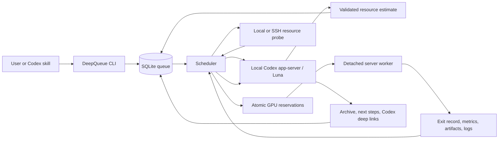
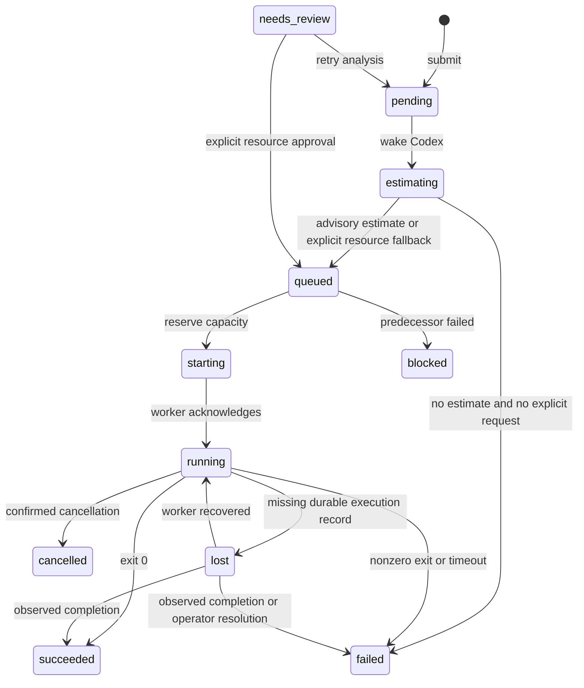

# DeepQueue Design

DeepQueue is an experiment queue for a researcher and their agents. The primary
workflow is to submit a complete experiment round, leave scheduling to the daemon,
and return to the results and proposed next steps. Experiments can target different
SSH servers, reserve several GPUs, and depend on earlier experiments.

## Components

The CLI and skill are clients of one queue database. The daemon owns scheduling;
the local or remote worker owns the experiment process. Codex analyzes evidence
but does not launch commands. Its structured output is validated before the job
becomes eligible to run.

Batch input is compiled before insertion. Optional parameter matrices become
ordinary validated jobs, each retaining its parameter values and expanded command.
The preview and submission paths use the same compiler. Dependencies are resolved
after expansion, and insertion remains one transaction. The original manifest
hash preserves idempotency, including across reordered matrix axis names.

## Task Lifecycle

Cancellation before execution moves directly to `cancelled`. Cancellation of an
active run records a request, which the worker implements using TERM and then KILL
for the training process tree. The scheduler retains reservations until confirmed exit.

Archival has an independent state: `pending`, `running`, `completed`, `failed`, or
`skipped`. An archive failure cannot change an experiment's execution outcome.
`job retry-agent --phase archive` retries summarization, never the command.

## Scheduling

Each job targets one explicit server. The agent estimates GPU count, per-GPU MiB,
GPU model requirements, CPU cores, system RAM, expected duration, confidence,
rationale, evidence, and warnings. User-specified resource values remain the
execution contract. Confidence, warnings and suspected code/config issues are
advisory input for the launch agent, including estimates exceeding that contract.

The scheduler combines fresh `nvidia-smi` and `/proc` data with its own reservations:

- GPUs must match the requested model, memory, server allowlist, and physical IDs.
- Whole GPUs are exclusive. A GPU with compute processes, high utilization, or
  more than the configured idle memory allowance is unavailable.
- An idle utilization sample alone does not make a GPU available. Existing compute
  processes and reserved GPUs exclude it even during initialization or data loading.
- Missing GPU telemetry blocks GPU jobs. CPU-only work remains eligible.
- CPU and RAM admission also subtract active reservations. This is deliberately
  conservative because a process can consume more memory later in its run.
- Jobs use priority plus waiting-time aging. Eligible smaller jobs can fill free
  capacity. After an older GPU job has waited one aging interval, younger GPU jobs
  stop taking new capacity while the older request gathers its GPUs, provided its
  static requirements can fit that server.
- Failed or cancelled predecessors block their dependents. Successful exit unlocks
  dependencies; archival does not delay the next experiment.

GPU assignments are persisted by UUID. `CUDA_VISIBLE_DEVICES` contains those UUIDs,
in the requested order for pinned devices. A request for physical GPU 4 therefore
appears as CUDA device 0 inside a one-GPU process. CPU-only jobs receive an empty
CUDA visibility list. Experiment code must honor this contract.

## Persistence and Recovery

The database uses WAL, foreign keys, immediate write transactions, and a unique
`(server, GPU UUID)` lease. A process lock permits one daemon per queue home.
Each launch has an immutable run ID stored before dispatch. Repeated requests for
that ID refer to the same worker record.

The worker is a versioned standard-library Python file transferred over SFTP. Its
execution lock and durable state file prevent a duplicate command after a lost
SSH response or daemon restart. The supervisor and experiment run independently
of the SSH channel and scheduler. Exit records are written atomically and synced.

Process identity includes PID, Linux start ticks, and boot ID. If the worker
disappears and command completion is unknown, the job becomes `lost`. GPU, CPU,
and RAM reservations stay held. Recovery must establish completion, or an operator
must resolve the job after checking the server. The system does not claim exactly
once execution across disk loss, remote record deletion, or arbitrary host failure.

## Agent Integration

The app-server adapter uses the installed `codex app-server` executable over stdio,
or the existing app-server's local Unix WebSocket:
`initialize`, `initialized`, `thread/start`, `turn/start`, item events, and
`turn/completed`. `turn/start.outputSchema` constrains estimate and legacy archive JSON.
The thread ID and deep link are committed immediately after `thread/start`, before
inference. A failed or interrupted model request therefore remains traceable.

Agent submissions use `--from-agent` to persist their real `CODEX_THREAD_ID` as
`spec.source_thread_id`. Estimates use separate tasks. Terminal-job archives
resume the recorded source with `thread/resume`, append an evidence-bearing turn,
and store that conversation's Markdown reply verbatim. Jobs without a source ID
retain separate persistent archive tasks. Default deep links use
`codex://threads/{thread_id}`; `link_template` is configurable for host-specific
desktop routing. `codex resume THREAD_ID` is also saved. Opening a desktop link
requires that desktop to have access to the same Codex host and session storage.

Evidence contains selected code/config prefixes, resource telemetry, prior
experiment summaries, exit records, measured RAM/GPU peaks, a bounded log tail,
and selected artifact prefixes. SSH credentials and environment values are
excluded from prompts. New analysis tasks use a read-only filesystem sandbox;
source callbacks inherit their original cwd, instructions, permissions and model.
By default no model override is sent on the callback turn. Jobs may set separate
`agent_models` for estimate, launch, and archive; queue defaults apply per stage.
An archive selection of `source-thread` resolves the conversation's current model
at dispatch. Concrete archive model IDs explicitly override that source turn and
subsequent turns. Improvement children inherit the parent's choices by stage.
Global model and reasoning-effort defaults are editable through General Settings.
The scheduler reloads only these agent defaults before a scheduling cycle and
captures a copy for each admitted agent. This preserves in-flight calls when the
user edits settings. Job overrides remain optional, and schema 5 adds a nullable
effort to agent history without inventing values for older attempts.
Summaries focus on experimental
effectiveness and targeted model changes. Finish mode only summarizes; improve mode
also authorizes changes and one child submission. Summary text is in Simplified Chinese.

Schema 4 adds a separate launch phase after reservation. Its new agent returns a
validated command, environment additions and per-run files; workers write them under
`DEEPQUEUE_RUN_DIR`. Physical GPU UUID visibility maps to contiguous logical device
indexes. A fresh probe checks the reserved devices again before executing. Each
worker retains a tmux log window, while the supervisor owns process cancellation.

Schema 6 records an automatic recovery counter on each job, recovery ancestry on
each execution, and the execution ID on launch-agent records. Launch preparation
uses only the actual allocation mapping and treats resource review as complete.
Historical peak-memory uncertainty does not stop launch preparation.

An observed CUDA OOM, device-mapping or recognized startup-configuration failure creates a new execution attempt in
the same job. Its agent receives the previous plan, runtime result and log tail.
OOM recovery may reduce per-device batch size and use supported accumulation,
precision or checkpointing options; the original submitted spec stays unchanged.
GPU leases transfer atomically after the old training process tree is confirmed stopped.
Late results cannot finish a newer execution. Source archiving starts only after
the final outcome and receives the complete execution history.

The worker follows training descendants across process groups and sessions. Linux
subreaper adoption keeps orphaned DDP ranks attributable after a launcher exits;
PID start times prevent acting on reused process IDs. All tracked descendants are
stopped before the durable exit record is written.

The worker samples GPU usage for this process tree. Unallocated GPU use ends
that attempt; allocated GPUs still unused 120 seconds after first GPU activity
also trigger mapping recovery. Before execution, a newly occupied reservation can
be replaced with other eligible cards on the same server and replanned. Explicit
GPU constraints still apply. These probes are not hardware isolation.
NVIDIA PIDs must be visible in the worker's PID namespace. Inaccessible IDs are
reported as a telemetry limitation; incomplete attribution does not trigger
process termination. Native SSH workers normally share the GPU host's PID namespace.

Automatic execution repair defaults to three retries, separate from scientific
improvement rounds. `launch_max_retries` is a hot-reloaded global setting (0-10),
with a nullable per-job override adjustable before the next attempt.
Exhaustion or an unrecoverable error ends the job and returns its result, without
another human-review state. Missing remote exit evidence retains reservations;
cancellation always prevents automatic retry.

Improve mode defaults to one additional round. Parent-child uniqueness and an
inherited round counter bound continuation. Children use priority 100 and sort
ahead of ordinary jobs. Finished parents retain resources for up to 900 seconds;
reservation transfers the hold transactionally to the child. Expiry, archive
failure, no child after summarization or an explicit finish releases the hold.
Running jobs are not preempted, and dependency and capacity checks still apply.

Schema 3 persists logical delivery IDs and dispatch intent. Admission serializes
archive calls to the same source; active conversations defer without consuming
model-failure retries. After disconnects or daemon restarts, a matching completed
turn is reused, an active one is allowed to finish, and unknown delivery status
stops automatic retransmission. Explicit archive retries request a new delivery.
The app-server API has no atomic idle-only turn start, so external user activity
can still race the final idle check; the queue's own callbacks remain serialized.

Next steps and suggested commands are retained as proposals. A new experiment
round is submitted explicitly; this version does not create an unlimited recursive
optimization loop.

Protocol references: [Codex app-server](https://learn.chatgpt.com/docs/app-server)
and [Codex skill discovery](https://learn.chatgpt.com/docs/build-skills).

## Current Boundaries

This release is for a trusted Linux research environment with one coordinator and
multiple execution servers. It does not implement multi-tenant authorization,
cgroups, MIG scheduling, preemption, distributed training across hosts, containers,
or process-level resource limits. CPU/RAM values are reservations, not enforced process limits.
CUDA visibility does not stop arbitrary code from selecting other devices.

External processes do not participate in the queue's reservation transaction and
can race a resource probe. Shared servers should route experiment starts through
the queue or dedicate an allowlist of GPUs to it. Jobs must run in the foreground,
not launch another daemon, a detached process, or an external batch system.

The SQLite database belongs on a local disk, not a shared NFS mount. More than one
coordinator, quotas, automatic placement across servers,
and aggregate batch analysis are future extensions rather than current behavior.
