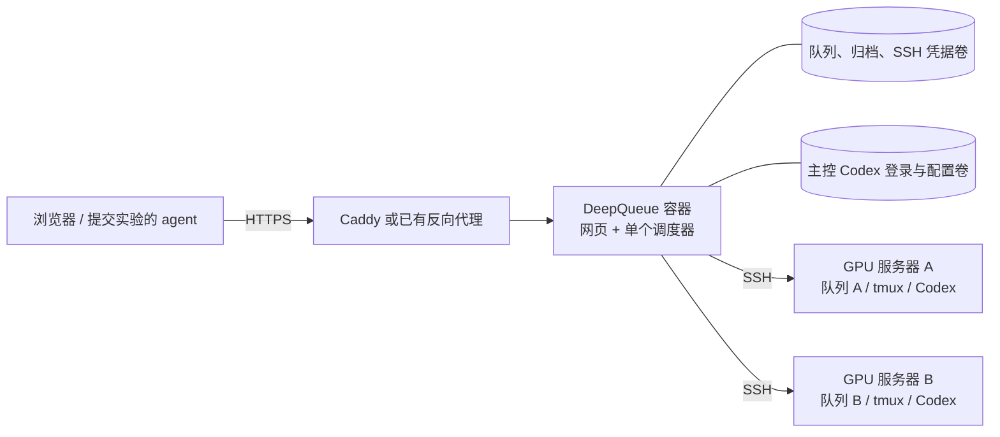

# Docker 公网部署

主控服务器运行 DeepQueue 网页/API、SQLite 队列和调度器，通过 SSH 连接训练服务器。训练环境、GPU、tmux 和实验文件保留在各训练服务器；任务始终只在提交时绑定的服务器排队和执行。



网页和调度器放在同一个容器内，因为现有启停接口通过进程 PID、启动标识和文件锁控制调度器。容器入口接收停止信号，先关闭网页，再正常停止调度器；已在远端启动的训练独立继续。一个队列卷只运行一个 DeepQueue 容器，不能增加副本数。

## 文件

| 文件 | 用途 |
| --- | --- |
| `Dockerfile` | 分阶段构建前端、锁定 Python 依赖、安装 Codex，生成运行镜像 |
| `.dockerignore` | 构建上下文白名单，排除本地队列、凭据、缓存和旧前端产物 |
| `compose.yaml` | DeepQueue 和可选的 Caddy HTTPS 代理 |
| `.env.example` | 域名、宿主机端口、Codex 版本及开机调度选项 |
| `deploy/docker/Caddyfile` | 自动 HTTPS、静态资源压缩、Codex SSE 实时转发 |
| `deploy/docker/compose.ssh.yaml` | 可选的只读 SSH 密钥目录挂载 |
| `scripts/docker_smoke.py` | 使用临时容器和卷进行镜像验收 |

镜像内含 Python 3.13、Node 22、Codex CLI **0.153.4**、SSH 客户端、Git、ripgrep 和 tmux。前端从 `package-lock.json` 构建，Python 依赖从 `uv.lock` 导出并校验哈希。程序以 UID/GID **10001** 运行。

## 首次部署

在装有 Docker Engine 和 Compose v2 的 Linux 公网服务器上执行。以下命令均从项目根目录运行。主控不需要 NVIDIA 驱动或 GPU 挂载。

```sh
cp .env.example .env
```

编辑 `.env`，将 `DEEPQUEUE_PUBLIC_URL` 改成实际的 HTTPS 地址，例如 `https://queue.your-domain.com`。不要加 `/api` 或子路径。域名的 DNS 应指向这台服务器；使用内置 Caddy 时，需要让公网能访问 80/443 端口。

```sh
docker compose build
docker compose run --rm deepqueue setup
```

`setup` 会创建数据库，暂停容器的 `local` 执行服务器，并在终端**首次显示管理员令牌**。保存该令牌，用它登录网页。重复执行会保留现有管理员、SSH 配置、任务和模型设置。正常启动不会在日志中输出令牌；未初始化时会明确退出并提示执行 `setup`。

登录主控容器内的 Codex，供资源预估和启动规划使用：

```sh
docker compose run --rm deepqueue codex login --device-auth
docker compose run --rm deepqueue codex login status
```

按终端提供的地址完成登录。账户使用自定义模型提供商时，配置持久化卷中的 `/home/deepqueue/.codex/config.toml` 和所需凭据。可在服务启动后导入准备好的配置：

```sh
docker compose exec -T deepqueue sh -c 'umask 077; cat > "$CODEX_HOME/config.toml"' < /secure/path/codex-config.toml
```

该配置文件留在部署机的私有位置，不放进项目构建目录。每个阶段的模型与推理强度随后在「通用设置」选择；当前项目默认模型为 `gpt-5.6-luna`。

使用内置 Caddy 启动：

```sh
docker compose --profile https up -d
docker compose ps
docker compose logs --tail=100 deepqueue caddy
```

打开配置的 HTTPS 地址，使用刚才的管理员令牌登录。Caddy 自动申请和续期证书，证书存入独立卷。Codex 对话事件直接流式转发，静态资源单独压缩。[Caddy 自动 HTTPS](https://caddyserver.com/docs/automatic-https)、[流式代理配置](https://caddyserver.com/docs/caddyfile/directives/reverse_proxy#streaming)。

如果主机已有 Nginx/Caddy/宝塔反向代理，则只启动应用：

```sh
docker compose up -d deepqueue
```

将已有代理指向 `http://127.0.0.1:8765`，或 `.env` 中配置的 `DEEPQUEUE_PORT`。可使用 `deploy/nginx.conf.example`，替换域名、证书路径和上游端口。保留 Host、`X-Forwarded-Proto`，关闭代理缓冲以支持 SSE。Compose 只把应用端口映射到宿主机回环地址；公网流量通过 HTTPS 代理进入。`FORWARDED_ALLOW_IPS=*` 用于信任该代理传入的 HTTPS 标识，避免登录 Cookie 缺少 Secure 属性；保持应用端口的回环绑定和 Compose 网络成员可信。

## 接入训练服务器和原 Codex 任务

1. 在「服务器资源」添加服务器的 SSH 地址、用户名和密码或密钥，并核对 SSH 主机指纹。
2. 远端准备 Bash、Python 3.10+、tmux、训练环境，以及 GPU 所需的驱动和 `nvidia-smi`。项目和数据集路径填写**远端绝对路径**。
3. 在该服务器的「Codex 工作区 → 连接设置」启用 Codex。远端 Codex 应登录到拥有原任务记录的账户，支持 `app-server proxy`。本项目验证版本为 0.153.4；该版本的共享服务启动要求官方安装器管理的独立版运行时，只有 npm 包时应先按 [Codex 接入说明](codex-workspace.md#接入)补齐。需要时填写远端 Codex 可执行文件绝对路径，点击「启动并连接」。通过 nvm 安装时，DeepQueue 会自动把该可执行文件所在目录加入连接进程的 PATH，以找到同目录的 Node。
4. 在「通用设置」确认预估、启动和归档的模型及推理强度；归档可选择沿用原会话模型。
5. 从每台服务器的接入配置生成提交令牌、下载专属 skill。skill 包含实际公网地址和绑定服务器；提交时附带原 Codex 任务 ID。
6. 确认资源探测和 Codex 连接正常后，再在「通用设置 → 系统运行」启动调度。

镜像内 Codex 通过 stdio 为主控的预估/启动阶段工作；远端工作区和归档使用对应服务器的 SSH Codex 连接，读取远端自己的 `~/.codex`。不用把远端 `.codex` 拷入主控，也不用开放远端 app-server 公网端口。主控容器不会自动运行一个共享的本地 Codex daemon；全局 `return_agent_socket=auto` 不能替代远端原会话连接。显式配置的 `return_agent_socket` 优先于服务器 Codex 连接，旧转发路径应按需清理或改成容器可访问的路径。

执行服务器上的提交客户端例如：

```sh
deepqueue --url https://queue.your-domain.com --target-server gpu-a client configure
deepqueue skill install --path ~/.agents/skills/deepqueue
deepqueue batch preview /project/experiments.json --from-agent
deepqueue batch submit /project/experiments.json --from-agent
```

`client configure` 会私下提示输入该服务器的提交令牌。服务器 A 的提交令牌不能提交或控制服务器 B 的任务。详细流程见 [公网部署](public-deployment.md) 和 [Codex 工作区](codex-workspace.md)。

### SSH 密钥

使用密码时，凭据由网页写入队列卷中的加密凭据库。密钥认证可额外挂载宿主机的密钥目录，例如：

```sh
sudo install -d -m 0700 -o 10001 -g 10001 /opt/deepqueue-keys
sudo install -m 0600 -o 10001 -g 10001 /secure/path/id_ed25519 /opt/deepqueue-keys/gpu-a
```

在 `.env` 增加 `DEEPQUEUE_SSH_DIR=/opt/deepqueue-keys`，以后使用同一组 Compose 文件管理服务：

```sh
docker compose -f compose.yaml -f deploy/docker/compose.ssh.yaml --profile https up -d
```

网页中的密钥文件路径填写 `/run/deepqueue-ssh/gpu-a`。该挂载只读，密钥不会进入镜像；加密私钥的口令仍在网页填写。已有反向代理的部署省略 `--profile https`。也可把私钥通过容器内用户写入 `/var/lib/deepqueue/ssh/`，由队列卷持久化。

如果 GPU 就在这台 Docker 宿主机上，也通过 SSH 注册它。容器中的 `localhost` 指容器自身，可使用宿主机的可达地址，或自行添加 `host.docker.internal:host-gateway` 映射。不要恢复容器的 `local` 队列来指代宿主机 GPU。

## 运行管理

默认 `DEEPQUEUE_START_SCHEDULER=false`，每次容器启动后调度器保持停止，可从网页或 CLI 开启。若需要机器重启后自动调度，将它改成 `true` 并重新创建服务；此时网页「停止调度」会保持到下一次容器重启，不会被入口程序立即拉起。

```sh
docker compose exec deepqueue deepqueue daemon status
docker compose exec deepqueue deepqueue daemon start
docker compose exec deepqueue deepqueue daemon stop
docker compose exec deepqueue deepqueue server list
docker compose exec deepqueue deepqueue server probe gpu-a
docker compose exec deepqueue deepqueue job list --server gpu-a
docker compose exec deepqueue deepqueue job mode JOB_ID improve --max-improvement-rounds 1
docker compose exec deepqueue deepqueue codex --help
```

网页日志通过 `docker compose logs -f deepqueue` 查看，调度日志通过以下命令查看：

```sh
docker compose exec deepqueue tail -n 100 -f /var/lib/deepqueue/scheduler.log
```

停止整个主控服务：

```sh
docker compose --profile https stop
```

Compose 给予 60 秒退出时间，入口会正常停止在网页/CLI 中开启的调度器。停止主控不会取消远端训练，重新启动调度后会恢复检查任务；需要停训练时使用网页取消或相应 job/batch CLI。[Compose 的 init 和退出等待](https://docs.docker.com/reference/compose-file/services/)。

健康检查仅检查已启用鉴权的 Web 入口，不会消耗模型额度，也不等同于 SSH、Codex 登录或 GPU 已准备好。使用 `docker compose ps` 查看状态，再通过网页分别检查资源和模型连接。

## 数据、备份与升级

| Compose 卷 | 容器目录 | 保存内容 |
| --- | --- | --- |
| `queue-data` | `/var/lib/deepqueue` | SQLite 队列、全局配置、管理员与提交令牌摘要、SSH 主机指纹、凭据密文/密钥、日志和归档 |
| `codex-data` | `/home/deepqueue/.codex` | 主控 Codex 登录、提供商配置及主控 agent 记录 |
| `caddy-data`、`caddy-config` | `/data`、`/config` | Caddy 证书和运行配置 |

默认卷名带 `deepqueue_` 前缀；自定义 Compose 项目名会使用另一组卷。普通 `down` 保留卷，`down -v` 会删除它们。SQLite 使用主控本地磁盘，不把队列卷放到跨主机共享文件系统供多个实例同时写入。

停机后备份完整目录，保留凭据密钥和 SQLite 的所有文件：

```sh
docker compose --profile https stop
umask 077
mkdir -p backups
docker compose run --rm -T deepqueue tar -C /var/lib/deepqueue -czf - . > backups/queue.tgz
docker compose run --rm -T deepqueue tar -C /home/deepqueue/.codex -czf - . > backups/codex.tgz
docker compose --profile https run --rm -T --no-deps --entrypoint tar caddy -C /data -czf - . > backups/caddy.tgz
```

备份文件包含凭据，应保存到私有备份位置。以上文件名用于示例，实际保留多份带日期的备份。使用外部代理时省略 Caddy 备份；只读挂载的 SSH 密钥和 `.env` 另行保存。

升级代码后：

```sh
docker compose build --pull
docker compose run --rm deepqueue setup
docker compose --profile https up -d
```

`setup` 在调度停止后执行数据库迁移，保留原管理员令牌和任务；公网地址以 `.env` 为准。恢复到新建的空卷时，可在 `setup` 前导入备份：

```sh
docker compose run --rm -T deepqueue tar -C /var/lib/deepqueue -xzf - < backups/queue.tgz
docker compose run --rm -T deepqueue tar -C /home/deepqueue/.codex -xzf - < backups/codex.tgz
docker compose --profile https run --rm -T --no-deps --entrypoint tar caddy -C /data -xzf - < backups/caddy.tgz
docker compose run --rm deepqueue setup
docker compose --profile https up -d
```

迁移现有非 Docker 部署时，先停止原 Web/调度器，再备份并导入完整队列目录，确保文件由 UID/GID 10001 可读写；检查原绝对路径和密钥路径。旧部署的 `local` 指旧主机，容器的 `local` 指容器，不能把两者当作同一台训练服务器。原 `local` 任务应在原部署收尾；新的训练服务器按 SSH 接入后重新提交。不要让原部署和容器同时管理同一个数据库。回滚旧镜像时同时使用升级前的备份。

## 验收

```sh
docker compose config --quiet
python3 scripts/docker_smoke.py --build
```

验收脚本构建默认 `deepqueue:local` 镜像，创建独立临时卷和回环临时端口，验证鉴权、Codex 可执行文件、网页启停调度、正常退出及重启持久化；结束后仅删除自己创建的容器和卷。需要保留生产镜像标签时指定 `--image deepqueue:smoke`。它不读取现有队列，不调用模型，也不启动训练。

源码级验证可运行 `uv run pytest -q tests/test_container.py`。这些测试启动真实 Web/调度进程并使用独立测试目录，但不能替代部署机上的 Docker 镜像验收。构建方式参考 [uv 的 Docker 指南](https://docs.astral.sh/uv/guides/integration/docker/)，Codex 安装方式参考 [官方 CLI 文档](https://developers.openai.com/codex/cli/)。
